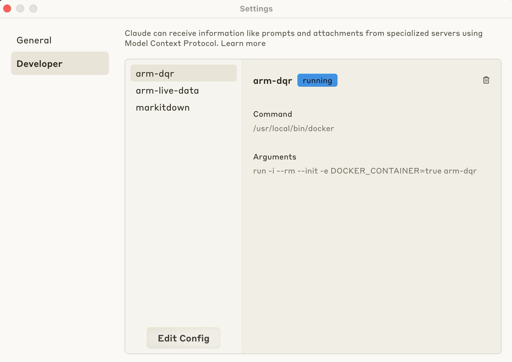
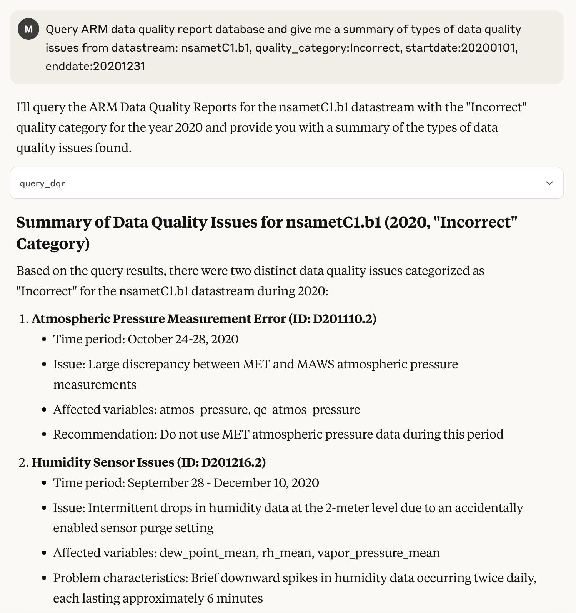

# MCP server for ARM Data Quality Report database
An MCP (Model Context Protocol) server for accessing Data Quality Report (DQR) database from the ARM user facility.


## Usage

### Set up your environment in MaxOS/Linus

_For setup in Windows, please refer to the [official guide](https://modelcontextprotocol.io/quickstart/server)._

Install `uv`.

```bash
curl -LsSf https://astral.sh/uv/install.sh | sh
```
Restart your terminal after installing `uv`.

### Set up project
```bash
# Create a new directory for this project or initialize it with an existing folder
uv init MCP-ARM-DQR
cd MCP-ARM-DQR

# Create virtual environment and activate it
uv venv
source .venv/bin/activate

# Install dependencies
uv add "mcp[cli]" "requests"

```

### Build docker image.
Doacker Image Name: `arm-dqr`
```bash
docker build -t arm-dqr .
```

### Add this MCP server to Claude Desktop app.
To use this server with the Claude Desktop app, click `developer`>`Edit Config` and add the following configuration to the "mcpServers" section of your `claude_desktop_config.json`:



```json
{
  "mcpServers": {
    "arm-live-data": {
      "command": "/usr/local/bin/docker",
      "args": [
        "run",
        "-i",
        "--rm",
        "--init",
        "-e",
        "DOCKER_CONTAINER=true",
        "arm-dqr"
      ]
    }
  }
}
```

## Components

### Tools

1. **query_dqr**
   - Description: Queries the ARM Data Quality Report (DQR) API for data quality information
   - Parameters:
     - `datastream`: The datastream to query (required)
     - `quality_category`: Quality category filter (optional)
     - `startdate`: Start date for filtering (optional)
     - `enddate`: End date for filtering (optional)
   - Returns: Dictionary containing the DQR data

_For more details about ARM Data Quality Report API, please refer to the [official documentation](https://dqr-web-service.svcs.arm.gov/docs)._

## Examples


